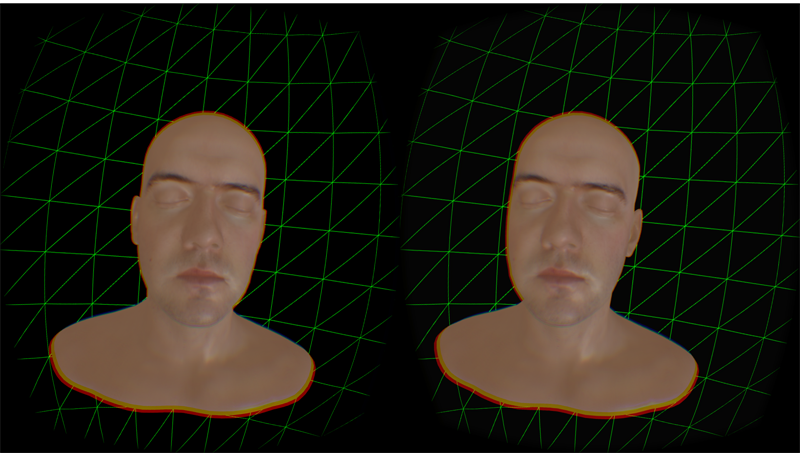

#head-webvr

Three.js webgl skin rendering demo with WebVR support.

[Original code by three.js team with Lee Perry-Smith head](https://github.com/mrdoob/three.js/blob/master/examples/webgl_materials_skin.html).

WebVR Adaptation by Pelle Beckman

You will need a webbrowser with webvr support.
For VR mode to work it has to be used with the Oculus enabled builds of [Firefox](http://mozvr.com/downloads.html) or [Chrome/Chromium](https://drive.google.com/a/google.com/folderview?id=0BzudLt22BqGRbW9WTHMtOWMzNjQ&usp=sharing#list)

Pelle Beckman, 2015

[@pbeck](http://twitter.com/pbeck), [beckmancreative.se](http://www.beckmancreative.se)